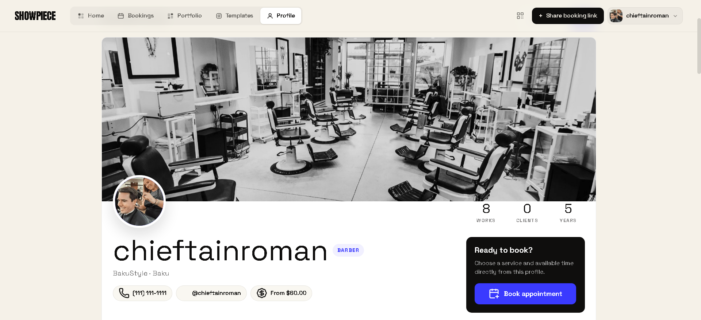
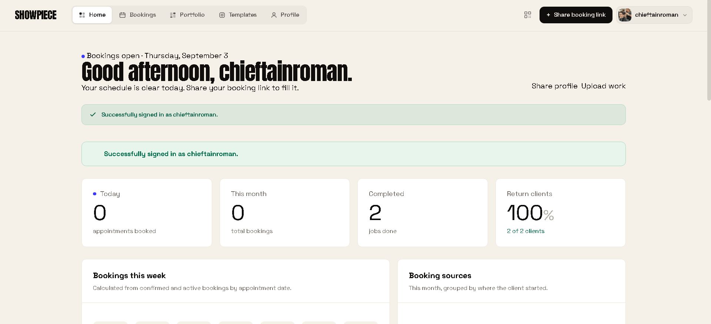
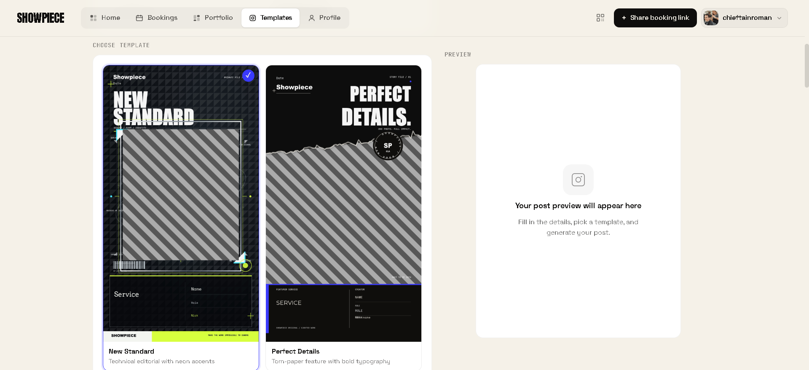
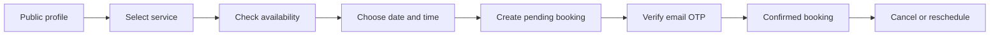

# Showpiece

A full-stack portfolio and appointment-booking platform for independent beauty professionals.

[Live application](https://showpiecehub.com) ·
[Public profile example](https://showpiecehub.com/profile/chieftainroman/)

## Overview

Showpiece gives beauty professionals one place to present their work, manage services, share availability, and accept appointments.

Clients can open a public profile or scan a QR code, select a service and available time, and confirm the appointment by email OTP without creating an account.

The project is deployed and under active development, with an emphasis on backend workflows, scheduling rules, authentication, media processing, and third-party integrations.

## Product Preview

### Public Professional Profile

| Dashboard | Social Content Templates |
| --- | --- |
|  |  |

## Product Capabilities

- Custom public profiles for barbers, stylists, nail artists, makeup artists, and other independent professionals
- Service management with pricing, duration, descriptions, images, visibility, and ordering
- Configurable working hours, unavailable periods, lead time, and concurrent-client capacity
- Public appointment booking without requiring a client account
- Email OTP confirmation with expiration, attempt limits, and request rate limiting
- Secure cancellation and rescheduling through expiring signed links
- Portfolio management with full-size work previews
- Dashboard metrics for bookings, completed work, revenue, sources, and returning clients
- Downloadable QR codes for sharing profiles and booking pages
- Branded social-media content generated through Placid templates
- Pillow fallback rendering when the external image service is unavailable
- Google authentication through `django-allauth`

## Booking Workflow

The availability engine evaluates:

- Professional working hours
- Selected service duration
- Minimum booking lead time
- One-time unavailable periods
- Recurring weekly blocks
- Existing pending and confirmed bookings
- Configured concurrent-client capacity

Booking intervals use half-open overlap rules, allowing one appointment to begin exactly when another ends.

## Engineering Highlights

### Service-Aware Scheduling

Availability is calculated dynamically in 15-minute intervals. A time slot is offered only when the service’s full duration fits within working hours and satisfies all availability and capacity constraints.

### Explicit Booking Lifecycle

Bookings move through clearly defined states:

* `pending_otp`
* `confirmed`
* `completed`
* `no_show`
* `cancelled`
* `refused`

### Accountless Client Actions

Clients receive signed, expiring links that allow them to cancel or reschedule appointments without creating or maintaining an account.

### Automated Media Workflow

Uploaded media is stored in Cloudinary. Showpiece maps profile and service data to Placid template layers, submits and monitors the rendering job, and automatically saves the completed asset to the professional’s portfolio.

### Graceful Degradation

If Placid cannot generate an image, Showpiece falls back to a local Pillow-based renderer. This provides a reduced-feature result without interrupting the overall user workflow.

## Architecture

| Application | Responsibility                                                                                                           |
| ----------- | ------------------------------------------------------------------------------------------------------------------------ |
| `accounts`  | Authentication, onboarding, professional profiles, services, availability settings, experience, honors, and certificates |
| `bookings`  | Slot calculation, appointment management, OTP verification, dashboards, cancellation, rescheduling, and QR codes         |
| `portfolio` | Portfolio management, media uploads, Placid integration, and Pillow-based fallback rendering                             |
| `core`      | Django configuration, middleware, root URL routing, and ASGI/WSGI entry points                                           |
| `templates` | Server-rendered interfaces for bookings, profiles, accounts, and emails                                                  |

## Technology Stack

| Layer               | Technologies                                |
| ------------------- | ------------------------------------------- |
| Backend             | Python, Django 4.2                          |
| Frontend            | Django Templates, HTML, CSS, JavaScript     |
| Database            | PostgreSQL, Django ORM                      |
| Authentication      | Django Auth, `django-allauth`, Google OAuth |
| Media               | Cloudinary, Pillow                          |
| Creative generation | Placid REST API                             |
| Email               | Django Email, Resend SMTP                   |
| Deployment          | Render, Gunicorn, WhiteNoise                |

## External Services

* **Cloudinary** stores profile images, service images, certificates, portfolio items, and generated media.
* **Placid** generates branded Instagram Story and post designs.
* **Resend** delivers verification, booking, cancellation, and rescheduling emails.
* **Google OAuth** provides third-party authentication through `django-allauth`.

## Local Development

Showpiece requires Python, PostgreSQL, and the dependencies listed in `requirements.txt`.

To configure a local development environment:

1. Create and activate an isolated Python environment.
2. Install the project dependencies.
3. Configure a PostgreSQL database.
4. Provide the required environment variables.
5. Apply the Django migrations.
6. Configure a Google `SocialApp` when testing Google authentication.
7. Start the Django development server.

PostgreSQL is required because professional profile languages are stored using PostgreSQL’s `ArrayField`.

## Environment Variables

| Variable         | Purpose                                                      |
| ---------------- | ------------------------------------------------------------ |
| `SECRET_KEY`     | Django signing and cryptographic operations                  |
| `DEBUG`          | Controls development or production mode                      |
| `DATABASE_URL`   | PostgreSQL database connection                               |
| `CLOUDINARY_URL` | Cloudinary account configuration                             |
| `PLACID_API_KEY` | Placid API authentication                                    |
| `RESEND_API_KEY` | Transactional email authentication                           |
| `SITE_URL`       | Public URL used in emails, QR codes, and signed action links |

Secret values must remain outside version control. Do not commit `.env` files or production credentials.

## Testing and Engineering Roadmap

Current automated test coverage focuses on onboarding middleware behavior.

The next engineering priorities are:

* Booking lifecycle regression and integration tests
* Slot-boundary and timezone tests
* Database-backed protection against concurrent bookings
* OTP expiration and abandoned-booking cleanup
* Mocked tests for email, Cloudinary, and Placid integrations
* Continuous integration for Django checks and automated tests
* Background processing for external-service operations

## Author

Developed by [Roman Mammadov](https://github.com/chieftainroman).

[GitHub Profile](https://github.com/chieftainroman) · [Live Application](https://showpiecehub.com)
